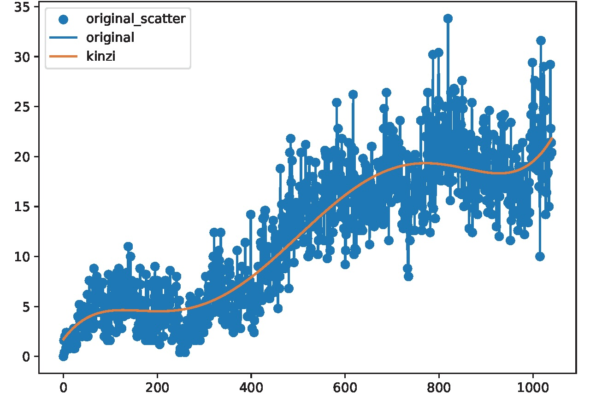

# Tetris AI with Genetic Algorithm

遺伝的アルゴリズムとニューラルネットワークを使用してテトリスをプレイするAIを進化させるプロジェクトです。

## 概要

このプロジェクトは、世代を重ねることでテトリスの性能を向上させるAIシステムです。ゲームプレイからトレーニングデータを生成し、ニューラルネットワークを訓練し、世代ごとにAIの性能を反復的に改善します。

## アーキテクチャ

プロジェクトは以下の世代進化サイクルに従います：

1. **データ生成** (`make_dates.py`): 並列テトリスゲームを実行してトレーニングデータを生成
2. **モデル訓練** (`make_model.py`): 前世代のデータを使用してニューラルネットワークを訓練
3. **AI評価** (`tetris-one.py`): 訓練されたモデルをテストして性能を記録
4. **ゲームロジック** (`tetris_class_constant.py`): テトリスゲームエンジンとAI統合

## 必要な環境

- Python 3.10
- 仮想環境での実行を推奨

## セットアップと実行

### 基本実行

```bash
# 5世代のトレーニングサイクルを実行（デフォルト）
./run.sh

# カスタム世代数を指定
./run.sh 10
```

### 手動セットアップ

```bash
# 仮想環境作成
python3.10 -m venv venv
source venv/bin/activate
pip install -r requirements.txt
```

### 個別ステップの実行

```bash
# データ生成（ゲーム数をstdinで指定）
echo 20 | python make_dates.py

# モデル訓練
python make_model.py

# モデル評価
python tetris-one.py

# 進捗の可視化
jupyter notebook make_graph.ipynb
```

## 実行結果例



## ファイル構成

### メインファイル

- `run.sh`: メインの実行スクリプト
- `tetris_class_constant.py`: テトリスゲームエンジンとAIインターフェース
- `make_dates.py`: ゲームプレイからの並列データ生成
- `make_model.py`: ニューラルネットワークのモデル構築プロセス
- `tetris-one.py`: モデル評価と性能ログ記録
- `make_graph.ipynb`: 訓練進捗とスコアの可視化
- `score.csv`: 世代間の性能を記録

### 生成されるディレクトリ

- `gen/`: 世代ログと中間データ
- `model_gen/`: 訓練済みKerasモデル（.kerasファイル）
- `data_gen/`: トレーニングデータCSVファイル
- `venv/`: Python仮想環境

## 依存関係

- TensorFlow/Keras: ニューラルネットワーク
- NumPy: データ処理
- Scikit-learn: モデル評価
- tqdm: 進捗表示
- matplotlib: グラフ可視化

## AIアーキテクチャ

AIは現在のボード状態を入力として受け取り、移動決定を出力するニューラルネットワークを使用します。遺伝的アルゴリズムアプローチは以下の方法で世代ごとにより良いモデルを進化させます：

1. 前世代の最高性能モデルを開始点として使用
2. ゲームプレイを通じて新しいトレーニングデータを生成
3. このデータで改良されたモデルを訓練
4. 性能を評価し、次世代のための最良モデルを選択

ゲーム状態は平坦化されたボードマトリックスとして表現され、AIはボード構成とピース位置に基づいて最適な移動を予測することを学習します。
